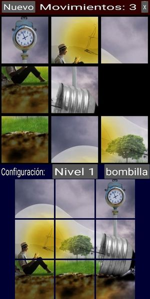

# 15 puzzle

_this is still under development_

## Rules of the game

This is the classic game where you have 15 tiles in a 4x4 grid, and you need to put them in the right order by using the empty tile to move the others. The image below shows an example of such a puzzle (almost solved):

The game offers different levels of difficulty (3x3, 4x4 or 5x5 game), and different themes besides the classical numbers: each theme is a square image, that has been cut into pieces (see below [Other resources](#other-resources) for info how to create a new theme).

You move the tiles by touching a tile adjacent to the empty space. This tile will move then to the empty space.

## Main screen

This is the main screen of the game.

It is divided in several areas:

- _top row_: it shows a toolbar with some buttons that will allow you different functions, and give the score.

- _main square_: this is where you have the tiles that you need to move, to complete the picture. They are randomly sorted at the beginning.

- _bottom_: here is where you choose the theme. You can see an example of the current theme image complete on the left. This is to be used for reference, especially important in more difficult games (e.g. 4x4 and 5x5). By clicking the button on the right, you can switch to another theme. Several themes are provided, the buttom will cycle through them.

## Buttons in toolbar

The buttons give you access to the following functions:

  - **Nuevo**: to start a new game. It will reset the score of movimientos, and start a new board with tiles randomly ordered, using the current theme and level.

  - **Nivel n**: this is to change the level. Level 1 is a board of 3x3, level 2 a board of 4x4, and level 3 a board of 5x5.

  - **Movimientos**: this is just a level (e.g. no button), it shows the current number of moves you made. This is the score, the higher the worse. The goal is to achieve a complete image with the minimum number of moves.

  - **X**: exit the app.

## Solvable puzzles

Note that not all puzzles of this kind (e.g. a puzzle of n x n squares with an empty space, randomly sorted) can be solved. I quickly realized that when I was doing the first tests. Fortunately, there is a way to find if a particular puzzle is solved, as explained in this page: [How to check if an instance of 15 puzzle is solvable?](https://www.geeksforgeeks.org/check-instance-15-puzzle-solvable/).

So I implemented a function based on this methodology to find if the puzzle that was randomly sorted was solvable; if not, I shuffle again and test again. This way I can ensure that all puzzles are solvable.

## Other resources

Under folder `resources` you can find additional files that I used to design and build the app. This folder is excluded from `buildozer` config.

- _esquemas.drawio_: diagrams to help identify how to identify tiles adjacent to the empty space.

- _creacion_temas_: this folder contains a couple of scripts I created to create new themes from a square image:
  - cut_image.py: will take a single image (to be provided in the command line) and will cut it into pieces of 3x3, 4x4, and 5x5, each of the sets under a folder named 3, 4, and 5 respectively.
  - cut_images.py: this will do the same process for all the images found in the directory. It will first create a folder with the same name as the image, move the image there, and cut it into different sets as described.

## Credits

The images I used for this game are taken from [GoodFon.com](https://www.goodfon.com/), they have no copyright limitations.

The sounds I found on [Free Sound](https://freesound.org/), and some of them I had found over Internet. I'm not aware of any copyright or limitation to use these.
