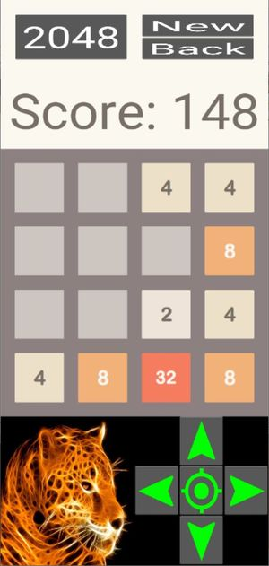

# 2048

_under development -- this page contains internal notes for the development of the game_

## Rules of the game

2048 is a single-player sliding block puzzle game designed by Italian web developer Gabriele Cirulli. The objective of the game is to slide numbered tiles on a grid to combine them to create a tile with the number 2048; however, one can continue to play the game after reaching the goal, creating tiles with larger numbers.

_(extracted from Wikipedia)_

Each turn you can move all tiles in one of the 4 directions: up, down, left or right. All tiles move in that direction as much as possible, until they find the edge of the board or another tile. In case they find another tile of the same value, the two tiles will merge and create a tile of double value. At each move, one new tile appears at any point of the board. The goal of the game is to have one tile of 2048 value.

## Main screen

This is the main screen of the game.

It is divided in several areas:

- _top row_: it shows some buttons, with the folloing functions:
  - 2048: clicking this button you can change the score required to win. It will alternate between 256, 512, 1024 and 2048. When a tile has this score, you win the game.
  - new: this button will start a new game, and reset the score
  - back: this button enables you to go back one move. Only one move is allowed.

- _score_: this line shows the score. The score is calculated by the value of merged cells: every time a cell merges, its value is added to the score.

- _main board_: this is where you have the tiles that you need to move. You move all tiles in the same direction, either by swipping or by using the joystick below.

- _joystick_: to move the tiles, instead of swipping.

## Other resources

Under folder `resources` you can find additional files that I used to design and build the app. This folder is excluded from `buildozer` config.

- _diagram.drawio_: diagrams to help find how to identify the final position of a tile that is moving.

- _8E25wA.jpg_: original image that I used to build the icon of the application.

## Credits

Image for the icon taken from: https://wallpapersafari.com/w/8E25wA.

The sounds I found on [Free Sound](https://freesound.org/), and some of them I had found over Internet. I'm not aware of any copyright or limitation to use these.
