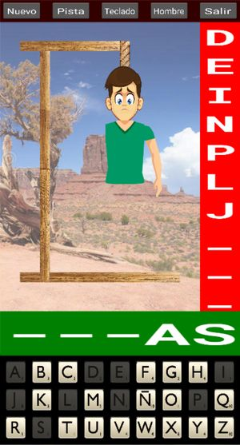

# Ahorcado

## Rules of the game

This is the game _hanged_, or _ahorcado_ in Spanish. It is pretty simple: given a word (where you can only see its length), you have to guess it by proposing letters:

  - Every letter proposed that exists in the word will appear in its correct position.
  - Every letter proposed that does not exist will contribute to building your gallows.

If you guess all letters, you win. If the gallows is finished before gessing all letters, you loose and you are hanged.

The words are in Spanish, taken from a Spanish book (see below [Other resources](#other-resources) for further details how the list of words was created).

## Main screen

This is the main screen of the game.

It is divided in several areas:

- _top row_: it shows a toolbar with some buttons that will allow you different functions

- _desert picture_: this is where your gallows will start to build

- _red strip_: the missed letters will show up here

- _green strip_: this will show the word being guessed. The letters that have not been guessed yet are shown as '-'.

- _bottom_: this is a keyboard, with a spanish layout (i.e. showing letter **Ñ**). Note that keys are alphabetically sorted.

## Buttons in toolbar

The buttons give you access to the following functions:

  - **Nuevo**: to start a new game. It will erase whatever is on the screen, and provide a new word and reset the keyboard.

  - **Pista**: this will give you a hint, i.e. show you one of the missing letters. You can only use this once in a game.

  - **Teclado**: it allows you to change the skin of your keyboard. Several skins are provided. By pressing the button you cycle through them.

  - **Hombre**: it allows you to change the picture of the man being hanged. Two different pictures are provided.

  - **Salir**: exit the app.

## Other resources

Under folder `resources` you can find additional files that I used to design and build the app. This folder is excluded from `buildozer` config.

- _esquema.drawio_: this is a diagram to help structure the screen, and the different parts.

- _ahorcado.kv_ files: these are copies of the different men I had. The original was with strokes (i.e. no real picture).

- _cuerda.png_: was used to create the icon and splash screen for the game.

- _generar_palabras.py_: small python script that will take a file as input, and will create a list of words. I've used as input the file called spanish_book.txt. You can use whatever book, or list of words that you want to use as source. The program will find individual words, put them to uppercase, remove any accents and punctuation, and duplicates, and create a list, that can be used by the main.py program.

- _spanish_book.txt_: this is a book in Spanish, taken from [Project Guttenberg](http://www.gutenberg.org/)

## Credits

The images I used for this game (e.g. desert picture, the rope, the men) I found them over internet, by searching images. No particular copyright or limitation provided.

The keys from the keyboard I found in [Perfect Icons](http://www.perfect-icons.com/index.htm) website, and also I built some others from sets that I found on Internet. These images cannot be used for commercial purposes, otherwise they are free for personal use.

The sounds I found on [Free Sound](https://freesound.org/), and some of them I had found over Internet. I'm not aware of any copyright or limitation to use these.
