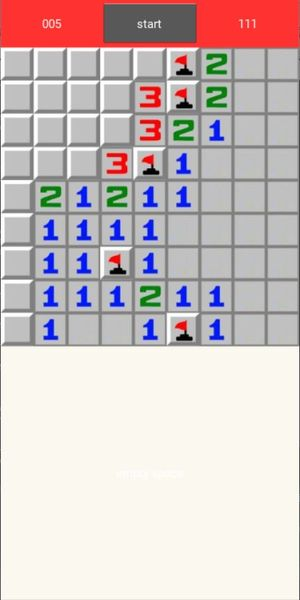

# Buscaminas (Minesweeper)

## Rules of the game

There is a field of mines. The field is divided in areas, each area can contain a mine or not. If no mines, it will show a number indicating the number of mines adjacent to the area. You have to use this information to discover where the mines are hiding. Your objective is to discover all mines, and uncover all areas without a mine.

Flag the areas where you think the mines are, with double click or right-click. You can flag and unflag the area as many times as you want; but when you uncover the area, it remains uncovered.

In the initial version, the minefield is always 9x9 size, with 10 mines. No option yet to change size or number of mines.

## Main screen

This is the main screen of the game.

It is divided in two areas:

- _top row_: has some indicators, and buttons. Left indicator is the number of mines left (i.e. each flag will you put decrease this number). The right indicator is the amount of seconds used.

- _playing ground_: this is the minefield. In the initial version, this is always 9x9 size, with 10 mines.

## Toolbar buttons and indicators

- Left indicator: it is the number of mines left (i.e. each flag will you put decrease this number).

- Right indicator: it shows the amount of seconds since the game started.

- Center button: this is the button to start a new game. It also will indicate the end of the game, showing different smileys if the game is won or lost.

- Size selector: this button allows you to select different board sizes. For now, only 9x9 is implemented.

- Action button: this button defines what action is triggered by the click: either flag an area, or uncover it.

## Other resources

Under folder `resources` I have a file with a diagram to know the position of the areas, and to help design the screen distribution.

I also have the original zip file of the font used, with the credits.

## Credits

I've used the images of this game from the original windows version. I've taken them from this website: https://minesweeper.us

For the indicators (mines and time), I've used the font digital-7, from 	Sizenko Alexander (http://www.styleseven.com)
