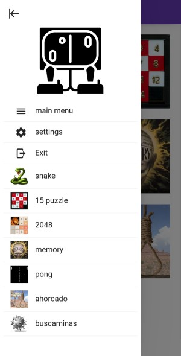
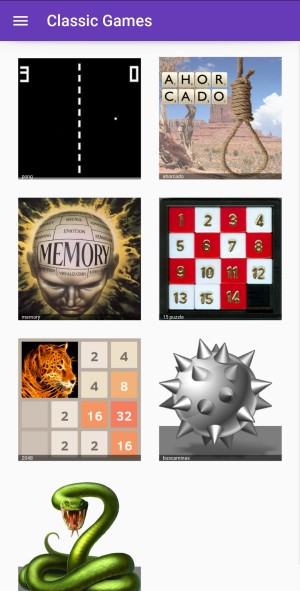
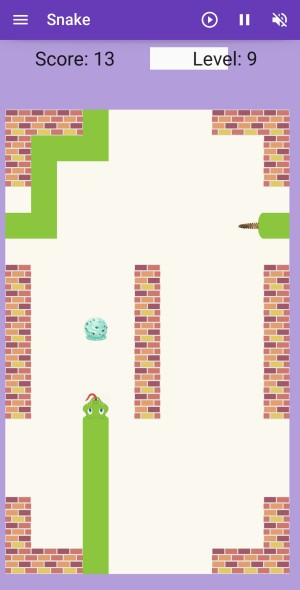
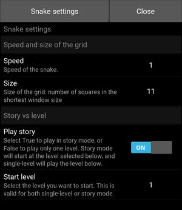

# Classic games

This is the game designed with [KivyMD](https://kivymd.readthedocs.io), consolidating all the other games in a single application, with a nice menu and navigation.

These instructions are for version 0.1. You can find [here](../changelogs/classic_games_changelog.md) a changelog explaining the changes introduced in each version.

## Application navigation

As shown in the fig. 1, the application will start with the main menu, showing an icon for each of the games. The icon will bring you directly to the game. For now, only Snake is implemented.

**Figure 1**. Menu of the application.

You can also open the menu on the left, to access some application options, and also links to the games. The menu on the left is accessible from any screen of the game.

The following options are available from the side menu:

- main menu: will bring you again to the main menu screen

- settings: will open the settings screen, allowing the configuration of the game parameters. The explanation of these parameters is provided as part of the game description.

- Exit: will leave the application.

(to be added in future versions):

- about: display information about the application and the author
- help: link to these instructions

## Game of snake

### Rules of the game

Very classic game, exists in most of the platforms, one of the first games ever built on a phone (old Nokia phones). There are many variants of the game.

In here, the player controls a snake that goes on the screen. There is a piece of food at a random location of the screen. When the snake eats the food, it grows the length, and a new piece of food appears (note that each type of food will have slightly different effects). The player has to avoid that the snake hits a wall or its own body: this will kill the snake. Reaching the end of the screen will not kill the snake, it will just pop up at the opposite end.

The game has different levels, each of them has a certain amount of walls that the snake has to avoid. Once you reach a partial score of the level (which depends on the grid size), you move to the next level.

Swipe on the screen to change the direction of the snake. The snake can turn 90 degrees in any direction.

The screen can be either portrait or landscape. If the screen changes, you should start a new game to take the dimensions into account.

### Main screen

This is the main screen of the game.

**Figure 2**. Screenshot of the snake game.

It is divided in three areas:

- _top row_: it shows a toolbar with some buttons that will allow you different functions, described in section [Buttons in toolbar](#buttons-in-toolbar).

- _results row_: display the score and the current level, with a progress bar on the level. When the progress bar reaches 100%, you move to the next level.

- _playing ground_: this is where the snake will run. Here you can see as well the current score of the game, which is the number of fruits you have eaten.

### Types of food

There are different types of food, and when eating them you will see a different behaviour:

| Type      | Behaviour                                                                                       | Examples                                                                                  |
| --------- | ----------------------------------------------------------------------------------------------- | ----------------------------------------------------------------------------------------- |
| Fruit     | Adds one snake part, and 2 points to the score. This is the healthy food!                       | ![][apple] ![][apple2] ![][bananas] ![][cherry] ![][kiwi] ![][strawberry] ![][watermelon] |
| Fast-food | Increases the speed of the snake by 50% for a while, adds 2 snake parts, and one point of score | ![][fries] ![][hamburger] ![][pizza]                                                      |
| Sweet     | adds 3 parts of the snake, one point of score.                                                  | ![][cake] ![][flan] ![][ice]                                                                |

Fruit is what you get most often. But watch out when eating other food, as you will suffer the consequences!

### Buttons in toolbar

The buttons give you access to the following functions:

  - ![][b_start]: to start a new game. It will reset the score, and remove the snake and food. It will create a new snake with the head only, and spawn a new food.

  - ![][b_mute_on]: mute the sounds of the game. Another click will unmmute. Note the icon will not change (this may be introduced in a future version).

  - ![][b_pause]: this button will pause the game. Another click will continue the game where it was.

### Settings

Fig. 3 shows a screenshot of the settings.

**Figure 3**. Settings window for game snake.

The following options are availble:

  - **Size**: to change the size of the head and food. They can be larger or smaller. You can select from a number of pre-defined sizes: 11, 15, 19, 23. This is the number of squares that has the shortest side of the window. So the higher the number, the smaller the square will be, and hence the smaller the snake parts and food.

  - **Speed**: to change the speed of the snake. You can select from a number of pre-defined speed factors: 0.5, 0.8, 1, 1.5, 2, 3. The game starts with a factor of 1 by default. The factor will be dividing the interval between updates of the game. Therefore, the higher the factor the smaller is the interval between updates, producing a higher speed.

  - **Play story**: this flag allows you to select the game mode: True to play in story mode, or False to play only one level. Story mode will start at the level selected below, and single-level will play the selected level endless.

  - **Start level**: You can select the level to start your story, from 1 to 12. If the game mode is single-level, this will be the level you play; if the game mode is story, you will start at this level.

The settings are saved, so next time you start the game it will maintain the same settings defined.

[b_start]: ../img/MD/snake/btn_play.png "Start button"
[b_mute_on]: ../img/MD/snake/btn_mute_on.png "Mute on button"
[b_pause]: ../img/MD/snake/btn_pause.png "Pause button"

[apple]: ../img/MD/snake/fruit-apple.png "Apple"
[apple2]: ../img/MD/snake/fruit-apple2.png "Apple"
[bananas]: ../img/MD/snake/fruit-bananas.png "Bananas"
[cherry]: ../img/MD/snake/fruit-cherry.png "Cherry"
[kiwi]: ../img/MD/snake/fruit-kiwi.png "Kiwi"
[strawberry]: ../img/MD/snake/fruit-strawberry.png "Strawberry"
[watermelon]: ../img/MD/snake/fruit-watermelon.png "Watermelon"

[fries]: ../img/MD/snake/junk-french-fries.png "French fries"
[hamburger]: ../img/MD/snake/junk-hamburger.png "Hamburger"
[pizza]: ../img/MD/snake/junk-pizza.png "Pizza"

[cake]: ../img/MD/snake/sweet-cake.png "Cake"
[flan]: ../img/MD/snake/sweet-flan.png "Flan"
[ice]: ../img/MD/snake/sweet-icecream.png "Ice cream"
