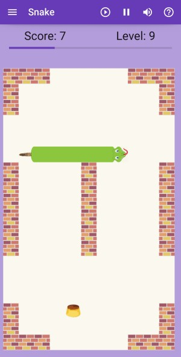

# Classic games

This is the game designed with [KivyMD](https://kivymd.readthedocs.io), consolidating all the other games in a single application, with a nice menu and navigation.

These instructions are for version 0.1. You can find [here](../changelogs/classic_games_changelog.md) a changelog explaining the changes introduced in each version.

## Application navigation

As shown in the fig. 1, the application will start with the main menu, showing an icon for each of the games. The icon will bring you directly to the game.

**Figure 1**. Menu of the application. On the left showing the full menu, on the right showing the game menu screen.

You can also open the menu on the left, to access some application options, and also links to the games. The menu on the left is accessible from any screen of the game.

The following options are available from the side menu:

- **main menu**: will bring you again to the main menu screen

- **settings**: will open the settings screen, allowing the configuration of the game parameters. The explanation of these parameters is provided as part of the game description.

- **Exit**: will leave the application.

(to be added in future versions):

- **about**: display information about the application and the author
- **help**: link to these instructions

* * * * * * * * * * * * * * * * * * * * * * * *

## Game of pong

### Rules of the game

Classic game of pong. Rules are pretty simple: two-player game, each player has a paddle and needs to use it to avoid that the ball touches his edge of the screen. The ball speeds up at each bounce.

If you miss the ball, your opponent gets a point. Game ends at 5 points.

### Main screen

This is the main screen of the game.

It is divided in two areas:

- _toolbar_: it shows a toolbar with some buttons that will allow you different functions

- _game board_: this is the field where you play

### Buttons in the game

Only two buttons show in the toolbar:

- ![][b_start]: to start a new game. It will reset the score, and start from the beginning, at the chosen speed.

- ![][b_pause]: this button will pause the game. Another click will continue the game where it was.

### Settings

The settings allow you to choose two parameters of the game:

- **Initial speed**: this is the speed of the ball, when starting (the speed will increase at each bounce). It can take any integer value. Note that negative values will be treated as positive (e.g. ignoring the sign).

- **Skin**: it allows you to change the skin of the game. This will change the picture of the ball and the two paddles.

* * * * * * * * * * * * * * * * * * * * * * * *

## Game of ahorcado (hanged)

### Rules of the game

This is the game _hanged_, or _ahorcado_ in Spanish. It is pretty simple: given a word (where you can only see its length), you have to guess it by proposing letters:

  - Every letter proposed that exists in the word will appear in its correct position.
  - Every letter proposed that does not exist will contribute to building your gallows.

If you guess all letters, you win. If the gallows is finished before gessing all letters, you loose and you are hanged.

The words are in Spanish, taken from a Spanish book taken from [Project Guttenberg](http://www.gutenberg.org/).

### Main screen

This is the main screen of the game.

It is divided in several areas:

- _top row_: it shows a toolbar with some buttons that will allow you different functions

- _desert picture_: this is where your gallows will start to build

- _red strip_: the missed letters will show up here

- _green strip_: this will show the word being guessed. The letters that have not been guessed yet are shown as '-'.

- _bottom_: this is a keyboard, with a spanish layout (i.e. showing letter **Ñ**). Note that keys are alphabetically sorted.

### Buttons in toolbar

The buttons give you access to the following functions:

  - ![][b_start]: to start a new game. It will erase whatever is on the screen, and provide a new word and reset the keyboard.

  - ![][b_help]: this will give you a hint, i.e. show you one of the missing letters. You can only use this once in a game.

  - ![][b_mute_on]: mute the sounds of the game. Another click will unmmute. Note the icon will not change (this may be introduced in a future version).

### Settings

The following options are available to be set for this game:

  - **Man**: to change the skin of the hanged man. There are 2 different skins.

  - **Keyboard**: to change the skin of the keyboard. There are 6 different skins available.

The settings are saved, so next time you start the game it will maintain the same settings defined.

* * * * * * * * * * * * * * * * * * * * * * * *

## Game of memory

### Rules of the game

You have a number of cards turned down, they contain different images. Each image is hidden in two different cards. The objective of the game is to discover all the pairs of cards with the same image.

At each turn, you flip 2 cards to show their image, and then:

- if they show the same image, you guessed one pair, and the cards remain up.
- if they show different images, the cards will turn down again after 2 seconds, giving you some time to memorize their position.

Each time you turn a pair of cards, the moves score is incremented by one. The goal is to find all the pairs, with the minimum number of moves.

### Main screen

This is the main screen of the game.

It is divided in several areas:

- _toolbar_: it shows a toolbar with some buttons that will allow you different functions (see below)

- _mid row_: it contains two buttons, and the score of the game. The game is scored as the number of moves you made. The goal being to have as little as possible, i.e. to guess all the pairs with as few moves as possible.

- _playing ground_: this is where the cards are.

### Buttons in the game

There are some buttons in the toolbar, and some in the mid-row. The buttons give you access to the following functions:

- ![][b_start]: to start a new game. It will reset the score, and regenerate the images, using the current theme and level (number of pairs). Note that even if the set is the same as previous game, the images can be different, as they are picked randomly from a larger set of images.

- ![][b_mute_on]: mute the sounds of the game. Another click will unmmute. Note the icon will not change (this may be introduced in a future version).

- _theme button_: to change the theme used for hte images. The text of second button actually is the name of the theme. This will pick images from that particular theme. A number of themes are provided.

- _level button_: it shows the number of pairs to be created when starting a new game.This means you will have the double of cards (e.g. 6 pairs means you play with 12 cards). The values possible are from 2 to 20. When clicked, its value will increase by 1, unless you are already at  20, in which case it will move down to 2.

The theme and level of the game can also be chosen from the settings panel. In this case, their value will be saved, remembered the next time you start the application.

* * * * * * * * * * * * * * * * * * * * * * * *

## Game of 15 puzzle

### Rules of the game

This is the classic game where you have 15 tiles in a 4x4 grid, and you need to put them in the right order by using the empty tile to move the others. The image below shows an example of such a puzzle (almost solved):

The game offers different levels of difficulty (3x3, 4x4 or 5x5 game), and different themes besides the classical numbers: each theme is a square image, that has been cut into pieces.

You move the tiles by touching a tile adjacent to the empty space. This tile will move then to the empty space.

### Main screen

This is the main screen of the game.

It is divided in several areas:

- _toolbar_: it shows a toolbar with some buttons that will allow you different functions, and give the score.

- _score_: the score is shown by the number of moves you made. The higher the worse. The goal is to achieve a complete image with the minimum number of moves.

- _main square_: this is where you have the tiles that you need to move, to complete the picture. They are randomly sorted at the beginning.

- _bottom_: here is where you choose the theme and level. You can see an example of the current theme image complete below. This is to be used for reference, especially important in more difficult games (e.g. 4x4 and 5x5). The buttons allow you to change the level and the theme. Several themes are provided, the button will cycle through them.

### Buttons in toolbar

The buttons give you access to the following functions:

- ![][b_start]: to start a new game. It will reset the score of moves, and start a new board with tiles randomly ordered, using the current theme and level.

- ![][b_mute_on]: mute the sounds of the game. Another click will unmmute. Note the icon will not change (this may be introduced in a future version).

On the bottom screen, you find 2 buttons:

- **Theme**: this is to change the theme. The theme button will show the name of the theme, cycling through all available themes. By default, you start with the numbers.

- **Level n**: this is to change the level. Level 1 is a board of 3x3, level 2 a board of 4x4, and level 3 a board of 5x5.

These options can be set also through the settings panel.

### Solvable puzzles

Note that not all puzzles of this kind (e.g. a puzzle of n x n squares with an empty space, randomly sorted) can be solved. I quickly realized that when I was doing the first tests. Fortunately, there is a way to find if a particular puzzle is solved, as explained in this page: [How to check if an instance of 15 puzzle is solvable?](https://www.geeksforgeeks.org/check-instance-15-puzzle-solvable/).

So I implemented a function based on this methodology to find if the puzzle that was randomly sorted was solvable; if not, I shuffle again and test again. This way I can ensure that all puzzles are solvable.

* * * * * * * * * * * * * * * * * * * * * * * *

## Game of 2048

### Rules of the game

2048 is a single-player sliding block puzzle game designed by Italian web developer Gabriele Cirulli. The objective of the game is to slide numbered tiles on a grid to combine them to create a tile with the number 2048; however, one can continue to play the game after reaching the goal, creating tiles with larger numbers.

_(extracted from Wikipedia)_

Each turn you can move all tiles in one of the 4 directions: up, down, left or right. All tiles move in that direction as much as possible, until they find the edge of the board or another tile. In case they find another tile of the same value, the two tiles will merge and create a tile of double value. At each move, one new tile appears at any point of the board. The goal of the game is to have one tile of 2048 value.

### Main screen

This is the main screen of the game.

It is divided in several areas:

- _toolbar_: it shows a toolbar with some buttons that will allow you different functions (see below)

- _2048 button_: clicking this button you can change the score required to win. It will alternate between 256, 512, 1024 and 2048. When you reach this score, you win the game.

- _score_: this label shows the score. The score is calculated by the value of merged cells: every time a cell merges, its value is added to the score.

- _main board_: this is where you have the tiles that you need to move. You move all tiles in the same direction, either by swipping or by using the joystick below.

- _joystick_: to move the tiles, instead of swipping.

### Buttons in toolbar

The buttons give you access to the following functions:

- ![][b_start]: to start a new game, and reset the score.

- ![][b_back]: this button enables you to go back one move. Only one move is allowed.

- ![][b_mute_on]: mute the sounds of the game. Another click will unmmute. Note the icon will not change (this may be introduced in a future version).

* * * * * * * * * * * * * * * * * * * * * * * *

## Game of buscaminas (Minesweeper)

### Rules of the game

There is a field of mines. The field is divided in areas, each area can contain a mine or not. If no mines, when uncovering it will show a number indicating the number of mines adjacent to the area. You have to use this information to discover where the mines are hiding. Your objective is to discover all mines, and uncover all areas without a mine.

Flag the areas where you think the mines are. Use the button on the toolbar to enter in mode "flag", so when you click it will flag the area instead of uncovering. You can flag and unflag the area as many times as you want; but when you uncover the area, it remains uncovered.

The size of the field depends on the level chosen through the toolbar button. See below how to change the level.

### Main screen

This is the main screen of the game.

It is divided in three areas:

- _toolbar_: at the top. It contains some buttons to control behaviour of the game. See below for more details.

- _playing ground_: at the bottom of the screen. This is the minefield, where all the action happens.

- _status row_: between the toolbar and the minefield. It has some indicators, and the smiley. Left indicator is the number of mines left (i.e. each flag will you put decrease this number). The right indicator is the amount of seconds used. The smiley in the middle indicates the status of the game:
    - smiling face is the standard
    - wounded face when bomb explodes (e.g. you uncover a bomb). You lost the game.
    - sunglasses smoking cigar when you discovered all mines, and uncovered non-mines. You won the game

### Toolbar buttons

- ![][b_start]: start a new game. You can also start a new game by clicking on the smiley. It will redistribute the mines, using the size defined by the level.

- ![][b_mute_on]: mute the sounds of the game. Another click will unmmute.

- ![][b_bomb] / ![][b_flag]: this button defines what action is triggered by the click: either flag an area, or uncover it.

- ![][b_level]: this button allows you to select different levels of the game, corresponding to different sizes:
    - level 1: 9x9 board, with 10 mines
    - level 2: 9x18 board, with 25 mines
    - level 3: 18x36 board, with 125 mines

* * * * * * * * * * * * * * * * * * * * * * * *

## Game of snake

### Rules of the game

Very classic game, exists in most of the platforms, one of the first games ever built on a phone (old Nokia phones). There are many variants of the game.

In here, the player controls a snake that goes on the screen. There is a piece of food at a random location of the screen. When the snake eats the food, it grows the length, and a new piece of food appears (note that each type of food will have slightly different effects). The player has to avoid that the snake hits a wall or its own body: this will kill the snake. Reaching the end of the screen will not kill the snake, it will just pop up at the opposite end.

The game has different levels, each of them has a certain amount of walls that the snake has to avoid. Once you reach a partial score of the level (which depends on the grid size), you move to the next level.

Swipe on the screen to change the direction of the snake. The snake can turn 90 degrees in any direction.

The screen can be either portrait or landscape. If the screen changes, you should start a new game to take the dimensions into account.

### Main screen

This is the main screen of the game.

**Figure 2**. Screenshot of the snake game.

It is divided in three areas:

- _top row_: it shows a toolbar with some buttons that will allow you different functions, described in section [Buttons in toolbar](#buttons-in-toolbar).

- _results row_: display the score and the current level, with a progress bar on the level. When the progress bar reaches 100%, you move to the next level.

- _playing ground_: this is where the snake will run. Here you can see as well the current score of the game, which is the number of fruits you have eaten.

### Types of food

There are different types of food, and when eating them you will see a different behaviour:

| Type      | Behaviour                                                                                       | Examples                                                                                  |
| --------- | ----------------------------------------------------------------------------------------------- | ----------------------------------------------------------------------------------------- |
| Fruit     | Adds one snake part, and 2 points to the score. This is the healthy food!                       | ![][apple] ![][apple2] ![][bananas] ![][cherry] ![][kiwi] ![][strawberry] ![][watermelon] |
| Fast-food | Increases the speed of the snake by 50% for a while, adds 2 snake parts, and one point of score | ![][fries] ![][hamburger] ![][pizza]                                                      |
| Sweet     | adds 3 parts of the snake, one point of score.                                                  | ![][cake] ![][flan] ![][ice]                                                                |

Fruit is what you get most often. But watch out when eating other food, as you will suffer the consequences!

### Buttons in toolbar

The buttons give you access to the following functions:

  - ![][b_start]: to start a new game. It will reset the score, and remove the snake and food. It will create a new snake with the head only, and spawn a new food.

  - ![][b_mute_on]: mute the sounds of the game. Another click will unmmute. Note the icon will not change (this may be introduced in a future version).

  - ![][b_pause]: this button will pause the game. Another click will continue the game where it was.

### Settings

Fig. 3 shows a screenshot of the settings.

**Figure 3**. Settings window for game snake.

The following options are available:

  - **Size**: to change the size of the head and food. They can be larger or smaller. You can select from a number of pre-defined sizes: 11, 15, 19, 23. This is the number of squares that has the shortest side of the window. So the higher the number, the smaller the square will be, and hence the smaller the snake parts and food.

  - **Speed**: to change the speed of the snake. You can select from a number of pre-defined speed factors: 0.5, 0.8, 1, 1.5, 2, 3. The game starts with a factor of 1 by default. The factor will be dividing the interval between updates of the game. Therefore, the higher the factor the smaller is the interval between updates, producing a higher speed.

  - **Play story**: this flag allows you to select the game mode: True to play in story mode, or False to play only one level. Story mode will start at the level selected below, and single-level will play the selected level endless.

  - **Start level**: You can select the level to start your story, from 1 to 12. If the game mode is single-level, this will be the level you play; if the game mode is story, you will start at this level.

The settings are saved, so next time you start the game it will maintain the same settings defined.

* * * * * * * * * * * * * * * * * * * * * * * *

[b_start]: ../img/MD/icons/btn_play.png "Start button"
[b_mute_on]: ../img/MD/icons/btn_mute_on.png "Mute on button"
[b_pause]: ../img/MD/icons/btn_pause.png "Pause button"
[b_help]: ../img/MD/icons/btn_help.png "Pause button"
[b_back]: ../img/MD/icons/btn_back.png "Back button"
[b_bomb]: ../img/MD/icons/btn_bomb.png "Bomb button"
[b_flag]: ../img/MD/icons/btn_flag.png "Flag button"
[b_level]: ../img/MD/icons/btn_level.png "Level button"

[apple]: ../img/MD/snake/fruit-apple.png "Apple"
[apple2]: ../img/MD/snake/fruit-apple2.png "Apple"
[bananas]: ../img/MD/snake/fruit-bananas.png "Bananas"
[cherry]: ../img/MD/snake/fruit-cherry.png "Cherry"
[kiwi]: ../img/MD/snake/fruit-kiwi.png "Kiwi"
[strawberry]: ../img/MD/snake/fruit-strawberry.png "Strawberry"
[watermelon]: ../img/MD/snake/fruit-watermelon.png "Watermelon"

[fries]: ../img/MD/snake/junk-french-fries.png "French fries"
[hamburger]: ../img/MD/snake/junk-hamburger.png "Hamburger"
[pizza]: ../img/MD/snake/junk-pizza.png "Pizza"

[cake]: ../img/MD/snake/sweet-cake.png "Cake"
[flan]: ../img/MD/snake/sweet-flan.png "Flan"
[ice]: ../img/MD/snake/sweet-icecream.png "Ice cream"
