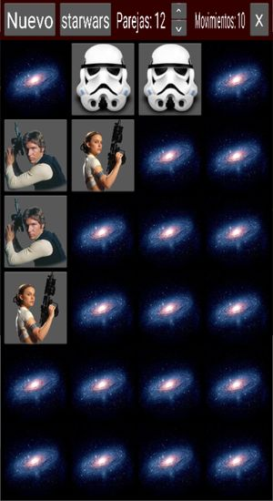

# Memory

## Rules of the game

You have a number of cards turned down, they contain different images. Each image is in two cards. You have to turn the cards, 2 each time, and then:

- if they show the same image, you guessed one pair, and the cards remain up.
- if they show different images, the cards will turn down again after 2 seconds, giving you some time to memorize their position.

Each time you turn a pair of cards, the moves score is incremented by one. The goal is to find all the pairs, with the minimum number of moves.

## Main screen

This is the main screen of the game.

It is divided in two areas:

- _top row_: it shows a toolbar with some buttons that will allow you different functions.

- _playing ground_: this is where the cards are.

## Buttons in toolbar

The buttons give you access to the following functions:

  - **Nuevo**: to start a new game. It will reset the score, and regenerate the images, using the defined set and number of pairs. Note that even if the set is the same as previous game, the images can be different, as they are picked randomly from a larger set of images.

  - **Topic**: to change the topic used. The text of second button actually is the name of the topic. This will pick images from that particular topic. A number of topics are provided.

  - **Parejas**: it shows the number of pairs to be created, when you next click the _Nuevo_ button. This means you will have the double of cards (e.g. 6 pairs means you play with 12 cards). Use the buttons to increase/decrease this number.

  - **Movimientos**: this is not a button, but you see here the number of moves you have made in this game. It is the score. The goal being to have as little as possible, i.e. to guess all the pairs with as few moves as possible.

  - **X**: exit the app.

## Other resources

Under folder `resources` I've put an additional sound file that I was planning to use as ambience sound. For now, it's not used in the game.

## Credits

The images I used for this game (e.g. desert picture, the rope, the men) are from [Perfect Icons](http://www.perfect-icons.com/index.htm) website. These images cannot be used for commercial purposes, otherwise they are free for personal use.

The sounds I found on [Free Sound](https://freesound.org/), and some of them I had found over Internet. I'm not aware of any copyright or limitation to use these.
