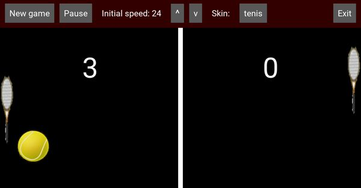

# Pong

## Rules of the game

Classic game of pong. This was my first app, I followed the tutorial from [Kivy website](https://kivy.org), and added some functionality in terms of changing skin, etc.

Rules are pretty simple: two-player game, each player has a paddle and needs to use it to avoid that the ball touches his edge of the screen. The ball speeds up at each bounce.

If you miss the ball, your opponent gets a point. Game ends at 5 points.

## Main screen

This is the main screen of the game.

It is divided in two areas:

- _top row_: it shows a toolbar with some buttons that will allow you different functions

- _main field_: this is the field where you play

## Buttons in toolbar

The buttons give you access to the following functions:

  - **New game**: to start a new game. It will reset the score, and start from the beginning, at the chosen speed.

  - **Pause**: will pause the game. Clicking again will continue the game.

  - **Initial speed**: the buttons allow to increase or decrease the initial speed of the ball. Choose to your liking.

  - **Skin**: it allows you to change the skin of the game. This will change the picture of the ball and the two paddles. Clicking the button will cycle through the different skins provided.

  - **Exit**: exit the app.

## Other resources

I have used one additional file, `pong.drawio`, to structure the different elements of the screen. The file is in the main folder of the game.

## Credits

The images I used for the skins of this game I found mainly in [Perfect Icons](http://www.perfect-icons.com/index.htm) website. These images cannot be used for commercial purposes, otherwise they are free for personal use.
