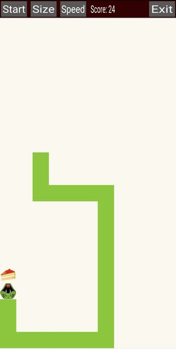

# Snake

## Rules of the game

Very classic game, exists in most of the platforms, one of the first games ever built on a phone (old Nokia phones). There are many variants of the game.

In here, the player controls a snake that goes on the screen. There is a piece of food in a random location of the screen. When the snake eats the food, it grows the length by one unit, and a new piece of food appears. The player has to avoid that the snake hits a wall or the body of the snake: this will kill the snake.

The game has different levels of difficulty, each of them has a certain amount of walls that the snake has to avoid. Once you reach a partial score of the level (which depends on the grid size), you move to the next level.

Turning the snake can be done by swiping on the screen. The snake can turn 90 degrees in any direction.

The screen can be either portrait or landscape. If the screen changes, you should start a new game to take the dimensions into account.

## Main screen

This is the main screen of the game.

_**TO BE UPDATED**_

It is divided in three areas:

- _top row_: it shows a toolbar with some buttons that will allow you different functions.

- _results row_: display the score and the current level, with a progress bar on the level. When the progress bar reaches 100%, you move to the next level.

- _playing ground_: this is where the snake will run. Here you can see as well the current score of the game, which is the number of fruits you have eaten.

## Buttons in toolbar

The buttons give you access to the following functions:

  - **Start**: to start a new game. It will reset the score, and remove the snake and food. It will create a new snake with the head only, and spawn a new food.

  - **Size**: to change the size of the head and food. They can be larger or smaller. At each click it will switch to the next size. You can cycle through a number of pre-defined sizes: 5, 10, 15, 20, 25. This is the number of squares that has the shortest side of the window. So the higher the number, the smaller the square will be, and hence the smaller the snake parts and food.

  - **Speed**: to change the speed of the snake. At each click it will switch to the next speed factor, varying from: 0.5, 0.8, 1, 1.5, 2, 3. The game starts with a factor of 1 by default. The factor will be dividing the interval between updates of the game. Therefore, the higher the factor the smaller is the interval between updates, producing a higher speed.
  
  - **Mute**: mute the sounds of the game. Another click will unmmute.
  
  - **Pause**: this button will pause the game. Another click will continue the game where it was.

  - : open a webpage with the instructions on how to play the game (this manual you are reading).

  - : exit the app.

## Credits

For the icons in the menubar I'm using [Material Design icons](https://material.io/resources/icons).

I found the snake head in [here](https://www.iconfinder.com/icons/3015218/dangerous_animal_reptile_serpent_head_snake_face_viper_icon). And the images for food are from [Perfect Icons](http://www.perfect-icons.com/index.htm) website. These images cannot be used for commercial purposes, otherwise they are free for personal use.

The sounds I found on [Free Sound](https://freesound.org/), and some of them I had found over Internet. I'm not aware of any copyright or limitation to use these.
