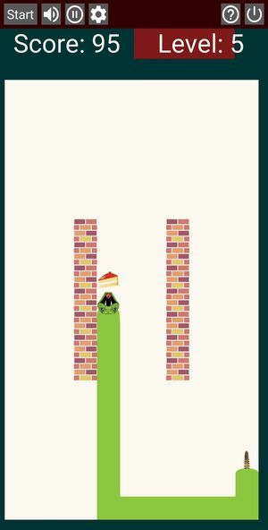

# Snake

## Rules of the game

Very classic game, exists in most of the platforms, one of the first games ever built on a phone (old Nokia phones). There are many variants of the game.

In here, the player controls a snake that goes on the screen. There is a piece of food in a random location of the screen. When the snake eats the food, it grows the length by one unit, and a new piece of food appears. The player has to avoid that the snake hits the extreme of the screen, or the body of the snake: this will kill the snake.

Turning the snake can be done by swiping on the screen. The snake can turn 90 degrees in any direction.

The screen can be either portrait or landscape. If the screen changes, you should start a new game to take the dimensions into account.

## Main screen

This is the main screen of the game.

It is divided in two areas:

- _top row_: it shows a toolbar with some buttons that will allow you different functions. Here you can see as well the current score of the game.

- _playing ground_: this is where the snake will run.

## Buttons in toolbar

The buttons give you access to the following functions:

  - **Start**: to start a new game. It will reset the score, and remove the snake and food. It will create a new snake with the head only, and spawn a new food.

  - **Size**: (not yet implemented). To change the size of the head and food. They can be larger or smaller. At each click it will switch to the next size. You can cycle through a number of pre-defined sizes.

  - **Speed**: (not yet implemented). To change the speed of the snake. At each click it will switch to the next speed. You can cycle through a number of pre-defined speeds.

  - **Exit**: exit the app.

## Credits

I found the snake head in [here](https://www.iconfinder.com/icons/3015218/dangerous_animal_reptile_serpent_head_snake_face_viper_icon). And the images for food are from [Perfect Icons](http://www.perfect-icons.com/index.htm) website. These images cannot be used for commercial purposes, otherwise they are free for personal use.

The sounds I found on [Free Sound](https://freesound.org/), and some of them I had found over Internet. I'm not aware of any copyright or limitation to use these.
